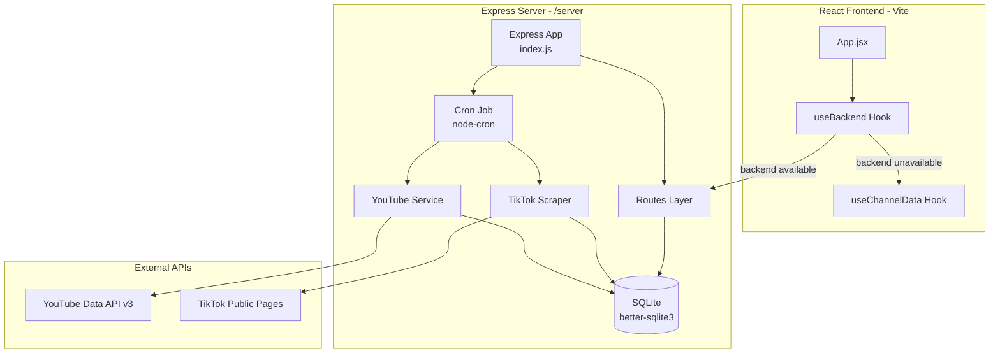
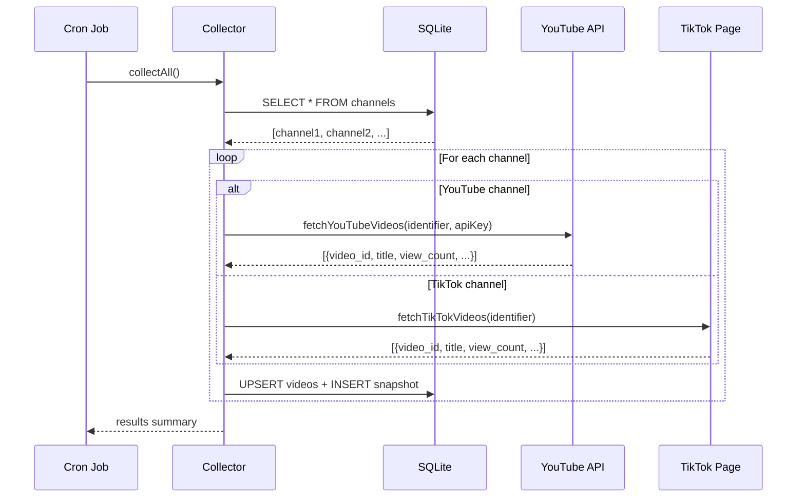
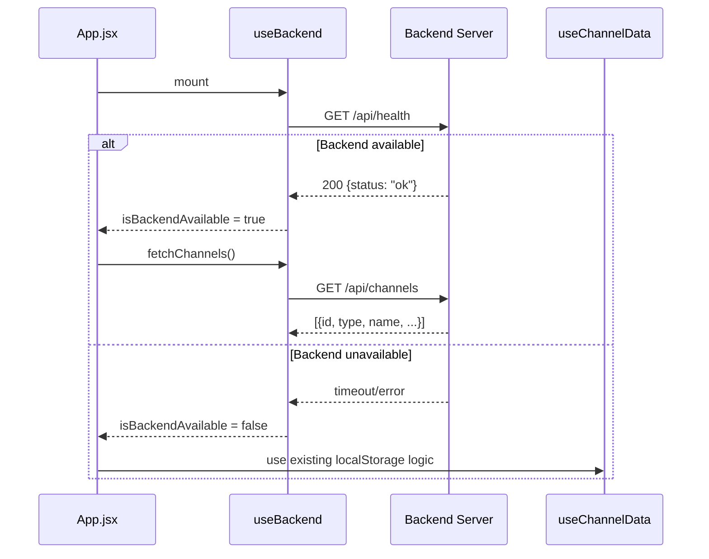

# Design Document: Backend Server

## Overview

Node.js + Express backend server for the Creator Stats Dashboard that runs in the `/server` directory. It collects video view snapshots hourly via a cron job (independent of browser state), stores data in SQLite via better-sqlite3, and exposes a REST API consumed by the frontend. TikTok data is scraped directly using axios + cheerio instead of the paid RapidAPI integration. The frontend gains a `useBackend` hook that prefers backend data when available, falling back to existing localStorage logic when the server is unreachable.

## Architecture



## File Structure

```
server/
├── index.js              — Express app entry, middleware, cron start
├── package.json          — dependencies and scripts
├── .env                  — YOUTUBE_API_KEY, PORT
├── data/
│   └── dashboard.db      — SQLite database (gitignored)
├── db/
│   └── index.js          — better-sqlite3 init, schema creation, WAL mode
├── routes/
│   ├── channels.js       — /api/channels CRUD routes
│   ├── videos.js         — /api/channels/:id/videos route
│   └── refresh.js        — /api/refresh + /api/health routes
├── services/
│   ├── youtube.js        — YouTube Data API v3 fetching
│   └── tiktok.js         — TikTok scraping with cheerio
└── cron/
    └── collector.js      — cron job logic, per-channel processing
```

## Components and Interfaces

### Component 1: Database Module (`db/index.js`)

**Purpose**: Initialize SQLite database, create schema, export db instance.

```javascript
// db/index.js
const Database = require('better-sqlite3');
const path = require('path');
const fs = require('fs');

const DATA_DIR = path.join(__dirname, '..', 'data');
const DB_PATH = path.join(DATA_DIR, 'dashboard.db');

// Ensure data directory exists
if (!fs.existsSync(DATA_DIR)) {
  fs.mkdirSync(DATA_DIR, { recursive: true });
}

const db = new Database(DB_PATH);

// Enable WAL mode and foreign keys
db.pragma('journal_mode = WAL');
db.pragma('foreign_keys = ON');

// Create tables
db.exec(`
  CREATE TABLE IF NOT EXISTS channels (
    id INTEGER PRIMARY KEY AUTOINCREMENT,
    type TEXT NOT NULL CHECK(type IN ('youtube', 'tiktok')),
    name TEXT NOT NULL,
    identifier TEXT NOT NULL,
    created_at TEXT NOT NULL DEFAULT CURRENT_TIMESTAMP
  );

  CREATE TABLE IF NOT EXISTS videos (
    id INTEGER PRIMARY KEY AUTOINCREMENT,
    channel_id INTEGER NOT NULL REFERENCES channels(id) ON DELETE CASCADE,
    video_id TEXT NOT NULL,
    title TEXT,
    thumbnail TEXT,
    published_at TEXT,
    updated_at TEXT
  );

  CREATE TABLE IF NOT EXISTS snapshots (
    id INTEGER PRIMARY KEY AUTOINCREMENT,
    video_id INTEGER NOT NULL REFERENCES videos(id) ON DELETE CASCADE,
    view_count INTEGER NOT NULL,
    timestamp INTEGER NOT NULL
  );
`);

module.exports = db;
```

**Responsibilities**:
- Create `server/data/` directory if missing
- Initialize SQLite database with WAL mode
- Enable foreign keys pragma
- Create channels, videos, snapshots tables with proper constraints
- Export singleton db instance

### Component 2: Channel Routes (`routes/channels.js`)

**Purpose**: CRUD operations for channel management.

```javascript
// routes/channels.js
const express = require('express');
const router = express.Router();
const db = require('../db');

// GET /api/channels — list all channels
router.get('/', (req, res) => {
  const channels = db.prepare('SELECT * FROM channels ORDER BY created_at DESC').all();
  res.json(channels);
});

// POST /api/channels — add a channel
router.post('/', (req, res) => {
  const { type, name, identifier } = req.body;

  if (!type || !name || !identifier) {
    return res.status(400).json({ error: 'Missing required fields: type, name, identifier' });
  }
  if (!['youtube', 'tiktok'].includes(type)) {
    return res.status(400).json({ error: 'type must be "youtube" or "tiktok"' });
  }

  const result = db.prepare(
    'INSERT INTO channels (type, name, identifier) VALUES (?, ?, ?)'
  ).run(type, name, identifier);

  const channel = db.prepare('SELECT * FROM channels WHERE id = ?').get(result.lastInsertRowid);
  res.status(201).json(channel);
});

// DELETE /api/channels/:id — remove a channel (cascades to videos + snapshots)
router.delete('/:id', (req, res) => {
  const { id } = req.params;
  const channel = db.prepare('SELECT * FROM channels WHERE id = ?').get(id);

  if (!channel) {
    return res.status(404).json({ error: 'Channel not found' });
  }

  db.prepare('DELETE FROM channels WHERE id = ?').run(id);
  res.json({ message: 'Channel deleted', id: Number(id) });
});

module.exports = router;
```

**Responsibilities**:
- List all channels (GET /api/channels)
- Create channel with validation (POST /api/channels)
- Delete channel with cascade (DELETE /api/channels/:id)
- Return proper HTTP status codes and error messages

### Component 3: Video Routes (`routes/videos.js`)

**Purpose**: Retrieve videos with snapshots for a channel.

```javascript
// routes/videos.js
const express = require('express');
const router = express.Router();
const db = require('../db');

// GET /api/channels/:id/videos — get 3 most recent videos with snapshots
router.get('/:id/videos', (req, res) => {
  const { id } = req.params;

  const channel = db.prepare('SELECT * FROM channels WHERE id = ?').get(id);
  if (!channel) {
    return res.status(404).json({ error: 'Channel not found' });
  }

  const videos = db.prepare(
    'SELECT * FROM videos WHERE channel_id = ? ORDER BY published_at DESC LIMIT 3'
  ).all(id);

  const videosWithSnapshots = videos.map(video => {
    const snapshots = db.prepare(
      'SELECT view_count, timestamp FROM snapshots WHERE video_id = ? ORDER BY timestamp ASC'
    ).all(video.id);

    return { ...video, snapshots };
  });

  res.json(videosWithSnapshots);
});

module.exports = router;
```

**Responsibilities**:
- Validate channel exists
- Return 3 most recent videos ordered by published_at
- Include full snapshot history for each video (ordered by timestamp ASC)

### Component 4: Refresh & Health Routes (`routes/refresh.js`)

**Purpose**: Manual refresh trigger and health check endpoint.

```javascript
// routes/refresh.js
const express = require('express');
const router = express.Router();
const { collectAll } = require('../cron/collector');

// POST /api/refresh — trigger immediate data collection
router.post('/refresh', async (req, res) => {
  try {
    const results = await collectAll();
    res.json({ status: 'ok', results });
  } catch (err) {
    res.status(500).json({ error: err.message });
  }
});

// GET /api/health — server availability check
router.get('/health', (req, res) => {
  res.json({ status: 'ok', timestamp: Date.now() });
});

module.exports = router;
```

**Responsibilities**:
- Trigger full data collection on demand
- Return collection results summary
- Provide health check for frontend availability detection

### Component 5: YouTube Service (`services/youtube.js`)

**Purpose**: Fetch latest videos and view counts from YouTube Data API v3.

```javascript
// services/youtube.js
const axios = require('axios');

const BASE_URL = 'https://www.googleapis.com/youtube/v3';

async function fetchYouTubeVideos(identifier, apiKey) {
  let channelId = identifier;

  // Resolve @handle to channel ID
  if (identifier.startsWith('@') || !identifier.startsWith('UC')) {
    const handle = identifier.startsWith('@') ? identifier : `@${identifier}`;
    const channelRes = await axios.get(`${BASE_URL}/channels`, {
      params: { part: 'contentDetails', forHandle: handle, key: apiKey }
    });

    if (!channelRes.data.items || channelRes.data.items.length === 0) {
      throw new Error(`YouTube channel not found: ${identifier}`);
    }
    channelId = channelRes.data.items[0].id;
  }

  // Get uploads playlist ID
  const channelRes = await axios.get(`${BASE_URL}/channels`, {
    params: { part: 'contentDetails', id: channelId, key: apiKey }
  });
  const uploadsPlaylistId = channelRes.data.items[0].contentDetails.relatedPlaylists.uploads;

  // Fetch 3 most recent uploads
  const playlistRes = await axios.get(`${BASE_URL}/playlistItems`, {
    params: {
      part: 'snippet',
      playlistId: uploadsPlaylistId,
      maxResults: 3,
      key: apiKey
    }
  });

  const videoIds = playlistRes.data.items.map(item => item.snippet.resourceId.videoId);

  if (videoIds.length === 0) return [];

  // Fetch video statistics
  const statsRes = await axios.get(`${BASE_URL}/videos`, {
    params: { part: 'statistics,snippet', id: videoIds.join(','), key: apiKey }
  });

  return statsRes.data.items.map(video => ({
    video_id: video.id,
    title: video.snippet.title,
    thumbnail: video.snippet.thumbnails.high?.url || video.snippet.thumbnails.medium?.url,
    published_at: video.snippet.publishedAt,
    view_count: parseInt(video.statistics.viewCount, 10) || 0
  }));
}

module.exports = { fetchYouTubeVideos };
```

**Responsibilities**:
- Resolve @handles to channel IDs via YouTube channels API
- Fetch uploads playlist to get 3 most recent videos
- Retrieve video statistics (view counts)
- Return normalized video data array

### Component 6: TikTok Scraper Service (`services/tiktok.js`)

**Purpose**: Scrape TikTok public profile pages for video data using axios + cheerio.

```javascript
// services/tiktok.js
const axios = require('axios');
const cheerio = require('cheerio');

const USER_AGENT = 'Mozilla/5.0 (Windows NT 10.0; Win64; x64) AppleWebKit/537.36 (KHTML, like Gecko) Chrome/120.0.0.0 Safari/537.36';

async function fetchTikTokVideos(identifier) {
  const username = identifier.startsWith('@') ? identifier.slice(1) : identifier;
  const url = `https://www.tiktok.com/@${username}`;

  const response = await axios.get(url, {
    headers: {
      'User-Agent': USER_AGENT,
      'Accept-Language': 'en-US,en;q=0.9',
      'Accept': 'text/html,application/xhtml+xml,application/xml;q=0.9,*/*;q=0.8',
    },
    timeout: 15000,
  });

  const $ = cheerio.load(response.data);

  // Extract JSON data from __UNIVERSAL_DATA_FOR_REHYDRATION__ script tag
  let videoData = [];
  const scriptTag = $('script#__UNIVERSAL_DATA_FOR_REHYDRATION__').html();

  if (scriptTag) {
    const jsonData = JSON.parse(scriptTag);
    const defaultScope = jsonData?.['__DEFAULT_SCOPE__'];
    const userDetail = defaultScope?.['webapp.user-detail'];
    const userModule = userDetail?.userInfo;
    const itemList = defaultScope?.['webapp.video-detail']?.itemList
      || Object.values(defaultScope || {}).find(v => v?.itemList)?.itemList
      || [];

    // Try to extract from user-detail page data
    if (itemList.length > 0) {
      videoData = itemList.slice(0, 3);
    }
  }

  // Fallback: try SIGI_STATE or other embedded JSON patterns
  if (videoData.length === 0) {
    const sigiScript = $('script').filter((_, el) => {
      const text = $(el).html() || '';
      return text.includes('"ItemModule"') || text.includes('"videoData"');
    }).first().html();

    if (sigiScript) {
      try {
        const parsed = JSON.parse(sigiScript);
        const items = parsed?.ItemModule || {};
        videoData = Object.values(items).slice(0, 3);
      } catch { /* ignore parse errors */ }
    }
  }

  return videoData.slice(0, 3).map(item => ({
    video_id: item.id || item.video?.id || String(item.createTime),
    title: item.desc || item.title || `Video by @${username}`,
    thumbnail: item.video?.cover || item.video?.dynamicCover || '',
    view_count: item.stats?.playCount || item.playCount || 0,
  }));
}

module.exports = { fetchTikTokVideos };
```

**Responsibilities**:
- Make HTTP GET to TikTok profile with browser-like headers
- Parse HTML with cheerio to find embedded JSON data
- Extract video IDs, titles, thumbnails, and view counts
- Return normalized array of up to 3 videos
- Handle parsing failures gracefully

### Component 7: Cron Collector (`cron/collector.js`)

**Purpose**: Orchestrate hourly data collection for all registered channels.

```javascript
// cron/collector.js
const db = require('../db');
const { fetchYouTubeVideos } = require('../services/youtube');
const { fetchTikTokVideos } = require('../services/tiktok');

async function collectForChannel(channel) {
  let videos;

  if (channel.type === 'youtube') {
    const apiKey = process.env.YOUTUBE_API_KEY;
    if (!apiKey) {
      console.warn(`[cron] Skipping YouTube channel "${channel.name}" — no YOUTUBE_API_KEY`);
      return { channel: channel.name, status: 'skipped', reason: 'no API key' };
    }
    videos = await fetchYouTubeVideos(channel.identifier, apiKey);
  } else if (channel.type === 'tiktok') {
    videos = await fetchTikTokVideos(channel.identifier);
  }

  const now = Date.now();

  // Upsert videos and insert snapshots
  const upsertVideo = db.prepare(`
    INSERT INTO videos (channel_id, video_id, title, thumbnail, published_at, updated_at)
    VALUES (?, ?, ?, ?, ?, ?)
    ON CONFLICT(channel_id, video_id) DO UPDATE SET
      title = excluded.title,
      thumbnail = excluded.thumbnail,
      updated_at = excluded.updated_at
  `);

  const insertSnapshot = db.prepare(
    'INSERT INTO snapshots (video_id, view_count, timestamp) VALUES (?, ?, ?)'
  );

  const transaction = db.transaction((vids) => {
    for (const v of vids) {
      upsertVideo.run(channel.id, v.video_id, v.title, v.thumbnail, v.published_at || null, new Date().toISOString());

      const dbVideo = db.prepare(
        'SELECT id FROM videos WHERE channel_id = ? AND video_id = ?'
      ).get(channel.id, v.video_id);

      insertSnapshot.run(dbVideo.id, v.view_count, now);

      console.log(`  [${channel.name}] ${v.title} — ${v.view_count.toLocaleString()} views`);
    }
  });

  transaction(videos);

  return { channel: channel.name, status: 'ok', videosProcessed: videos.length };
}

async function collectAll() {
  const channels = db.prepare('SELECT * FROM channels').all();
  console.log(`[cron] Starting collection for ${channels.length} channel(s)...`);

  const results = [];

  for (const channel of channels) {
    try {
      const result = await collectForChannel(channel);
      results.push(result);
    } catch (err) {
      console.error(`[cron] Error collecting "${channel.name}":`, err.message);
      results.push({ channel: channel.name, status: 'error', error: err.message });
    }
  }

  console.log(`[cron] Collection complete. Results:`, results);
  return results;
}

module.exports = { collectAll, collectForChannel };
```

**Responsibilities**:
- Iterate all registered channels
- Call appropriate service (YouTube or TikTok) per channel type
- Upsert video records (match on channel_id + video_id)
- Insert snapshot with current timestamp
- Isolate errors per channel (try/catch)
- Log progress to console

### Component 8: Server Entry Point (`index.js`)

**Purpose**: Wire everything together — Express app, middleware, routes, cron scheduling.

```javascript
// server/index.js
require('dotenv').config();
const express = require('express');
const cors = require('cors');
const cron = require('node-cron');
const channelRoutes = require('./routes/channels');
const videoRoutes = require('./routes/videos');
const refreshRoutes = require('./routes/refresh');
const { collectAll } = require('./cron/collector');

const app = express();
const PORT = process.env.PORT || 3001;

// Middleware
app.use(cors());
app.use(express.json());

// Routes
app.use('/api/channels', channelRoutes);
app.use('/api/channels', videoRoutes);
app.use('/api', refreshRoutes);

// Schedule hourly collection
cron.schedule('0 * * * *', () => {
  console.log(`[cron] Hourly collection triggered at ${new Date().toISOString()}`);
  collectAll();
});

// Immediate collection on startup
console.log('[cron] Running initial collection...');
collectAll();

// Start server
app.listen(PORT, () => {
  console.log(`[server] Backend running on http://localhost:${PORT}`);
});
```

**Responsibilities**:
- Load environment variables via dotenv
- Configure CORS (all origins) and JSON body parsing
- Mount route handlers
- Schedule hourly cron job
- Run immediate collection on startup
- Listen on configured port

### Component 9: Frontend Backend Hook (`src/hooks/useBackend.js`)

**Purpose**: Detect backend availability and provide backend-powered data fetching.

```javascript
// src/hooks/useBackend.js
import { useState, useEffect, useCallback } from 'react';
import axios from 'axios';

const BACKEND_URL = import.meta.env.VITE_API_URL || 'http://localhost:3001';

export function useBackend() {
  const [isBackendAvailable, setIsBackendAvailable] = useState(false);
  const [channels, setChannels] = useState([]);

  // Check backend health on mount
  useEffect(() => {
    axios.get(`${BACKEND_URL}/api/health`)
      .then(() => setIsBackendAvailable(true))
      .catch(() => setIsBackendAvailable(false));
  }, []);

  const fetchChannels = useCallback(async () => {
    const res = await axios.get(`${BACKEND_URL}/api/channels`);
    setChannels(res.data);
    return res.data;
  }, []);

  const fetchVideos = useCallback(async (channelId) => {
    const res = await axios.get(`${BACKEND_URL}/api/channels/${channelId}/videos`);
    return res.data;
  }, []);

  const addChannel = useCallback(async (channelData) => {
    const res = await axios.post(`${BACKEND_URL}/api/channels`, channelData);
    setChannels(prev => [...prev, res.data]);
    return res.data;
  }, []);

  const deleteChannel = useCallback(async (id) => {
    await axios.delete(`${BACKEND_URL}/api/channels/${id}`);
    setChannels(prev => prev.filter(c => c.id !== id));
  }, []);

  const refresh = useCallback(async () => {
    const res = await axios.post(`${BACKEND_URL}/api/refresh`);
    return res.data;
  }, []);

  return {
    isBackendAvailable,
    backendUrl: BACKEND_URL,
    channels,
    fetchChannels,
    fetchVideos,
    addChannel,
    deleteChannel,
    refresh,
  };
}
```

**Responsibilities**:
- Check backend health on mount
- Expose `isBackendAvailable` boolean
- Provide CRUD methods for channels via backend API
- Provide video fetching via backend API
- Provide manual refresh trigger
- Read VITE_API_URL from environment, default to http://localhost:3001

## Data Models

### channels table

| Column | Type | Constraints |
|--------|------|-------------|
| id | INTEGER | PRIMARY KEY AUTOINCREMENT |
| type | TEXT | NOT NULL, CHECK('youtube' or 'tiktok') |
| name | TEXT | NOT NULL |
| identifier | TEXT | NOT NULL |
| created_at | TEXT | NOT NULL DEFAULT CURRENT_TIMESTAMP |

### videos table

| Column | Type | Constraints |
|--------|------|-------------|
| id | INTEGER | PRIMARY KEY AUTOINCREMENT |
| channel_id | INTEGER | NOT NULL, FK → channels(id) ON DELETE CASCADE |
| video_id | TEXT | NOT NULL |
| title | TEXT | — |
| thumbnail | TEXT | — |
| published_at | TEXT | — |
| updated_at | TEXT | — |

**Unique constraint**: (channel_id, video_id) for upsert logic.

### snapshots table

| Column | Type | Constraints |
|--------|------|-------------|
| id | INTEGER | PRIMARY KEY AUTOINCREMENT |
| video_id | INTEGER | NOT NULL, FK → videos(id) ON DELETE CASCADE |
| view_count | INTEGER | NOT NULL |
| timestamp | INTEGER | NOT NULL (epoch ms from Date.now()) |

## Sequence Diagrams

### Cron Collection Flow



### Frontend Health Check Flow



## Error Handling

### Channel Collection Errors

**Condition**: YouTube API or TikTok scraping fails for a single channel
**Response**: Log error to console, record error in results array, continue to next channel
**Recovery**: Next hourly run will retry automatically

### Missing YouTube API Key

**Condition**: YOUTUBE_API_KEY not set in environment
**Response**: Skip all YouTube channels, log warning per channel
**Recovery**: Set the key in server/.env and restart

### TikTok Page Structure Change

**Condition**: cheerio cannot find expected JSON in page HTML
**Response**: Return empty array, log error, channel marked as error in results
**Recovery**: Update parsing logic in services/tiktok.js

### Invalid API Requests

**Condition**: Missing fields on POST /api/channels, non-existent IDs
**Response**: Return appropriate HTTP status (400, 404) with descriptive error JSON
**Recovery**: Client corrects request

## Environment Variables

### server/.env

```
YOUTUBE_API_KEY=your_youtube_api_key_here
PORT=3001
```

### Frontend .env (optional addition)

```
VITE_API_URL=http://localhost:3001
```

## Dependencies

### server/package.json

```json
{
  "name": "creator-dashboard-backend",
  "version": "1.0.0",
  "private": true,
  "scripts": {
    "start": "node index.js",
    "dev": "node --watch index.js"
  },
  "dependencies": {
    "better-sqlite3": "^11.0.0",
    "axios": "^1.7.0",
    "cheerio": "^1.0.0",
    "cors": "^2.8.5",
    "dotenv": "^16.4.0",
    "express": "^4.21.0",
    "node-cron": "^3.0.3"
  }
}
```

## Correctness Properties

*A property is a characteristic or behavior that should hold true across all valid executions of a system — essentially, a formal statement about what the system should do. Properties serve as the bridge between human-readable specifications and machine-verifiable correctness guarantees.*

### Property 1: Channel CRUD round-trip

*For any* valid channel data (type in ['youtube', 'tiktok'], non-empty name, non-empty identifier), creating a channel via POST and then fetching all channels via GET SHALL return an array containing that channel with matching type, name, and identifier.

**Validates: Requirements 2.1, 2.2**

### Property 2: CASCADE delete removes all associated data

*For any* channel with associated videos and snapshots, deleting that channel SHALL result in zero videos and zero snapshots referencing that channel's ID remaining in the database.

**Validates: Requirements 2.4**

### Property 3: Snapshot accumulation preserves history

*For any* video, each data collection run SHALL add exactly one new snapshot per video without modifying or removing existing snapshots, so that the total snapshot count for a video increases monotonically.

**Validates: Requirements 3.1, 3.4, 5.3**

### Property 4: Video upsert idempotence on metadata

*For any* video collected multiple times with the same video_id and channel_id, the videos table SHALL contain exactly one row for that (channel_id, video_id) pair, with the latest title and thumbnail values.

**Validates: Requirements 6.2, 7.3**

### Property 5: Channel isolation during collection

*For any* set of channels where one channel's service call throws an error, all other channels SHALL still be processed and have their snapshots recorded.

**Validates: Requirements 5.3, 5.5, 4.3**

### Property 6: Invalid channel creation rejection

*For any* POST request to /api/channels with missing type, name, or identifier, or with type not in ['youtube', 'tiktok'], the server SHALL return HTTP 400 and the channels table SHALL remain unchanged.

**Validates: Requirements 2.3**

### Property 7: Video retrieval limit

*For any* channel regardless of how many videos exist in the database, GET /api/channels/:id/videos SHALL return at most 3 videos, ordered by published_at descending.

**Validates: Requirements 3.1, 3.4**
