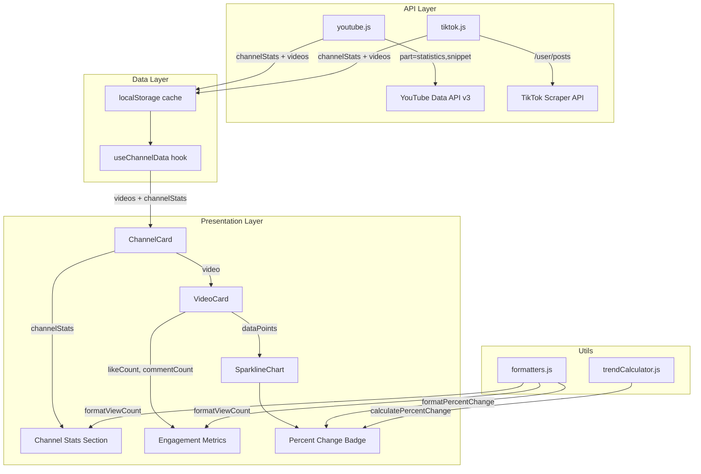

# Design Document: Channel Stats and Video Metrics

## Overview

Rozszerzenie dashboardu o trzy powiązane funkcjonalności metryk:
1. **Percent Change Badge** — liczbowy wskaźnik procentowej zmiany (np. "+12,3%") wyświetlany obok sparkline na VideoCard
2. **Channel Stats Section** — statystyki kanału (subskrybenci/obserwujący + łączne wyświetlenia/polubienia) w nagłówku ChannelCard
3. **Video Engagement Metrics** — polubienia (ThumbsUp) i komentarze (MessageCircle) na kartach filmów

Wszystkie trzy funkcjonalności bazują na danych już dostępnych w odpowiedziach API (YouTube i TikTok) — wymagają jedynie rozszerzenia mapowania i dodania elementów UI.

### Kluczowe decyzje projektowe

| Decyzja | Wybór | Uzasadnienie |
|---------|-------|--------------|
| Pobieranie statystyk kanału YT | Rozszerzenie istniejącego `channels` request o `part=statistics` | Minimalizacja wywołań API — jedno zapytanie zamiast dwóch |
| Pobieranie statystyk kanału TikTok | Ekstrakcja z pola `author` w odpowiedzi `/user/posts` | Brak dodatkowego zapytania — dane już obecne w odpowiedzi |
| Przechowywanie channel stats | Rozszerzenie istniejącego cache `creator-dashboard-data-{channelId}` o pole `channelStats` | Spójność z istniejącą architekturą cache |
| Formatowanie percent change | Nowa funkcja `formatPercentChange()` w formatters.js | Separacja odpowiedzialności, reużywalność, testowalność |
| Layout badge obok sparkline | Flex row: sparkline (flex-1) + badge (fixed width) | Naturalny flow, badge nie wpływa na szerokość wykresu |

## Architecture



### Przepływ danych

1. **Fetch** — `youtube.js` / `tiktok.js` pobierają dane i mapują do ujednoliconego formatu (rozszerzony o `likeCount`, `commentCount` + nowy obiekt `channelStats`)
2. **Cache** — `useChannelData` zapisuje do localStorage pod kluczem `creator-dashboard-data-{channelId}` obiekt `{ videos, channelStats, cachedAt }`
3. **Render** — `ChannelCard` otrzymuje `channelStats` z hooka i renderuje sekcję statystyk; `VideoCard` otrzymuje rozszerzony obiekt `video` z polami `likeCount`/`commentCount`
4. **Badge** — `VideoCard` oblicza percent change z `dataPoints` (z `useViewHistory`) i renderuje badge obok sparkline

## Components and Interfaces

### Nowa funkcja: `formatPercentChange(value: number): string`

Lokalizacja: `src/utils/formatters.js`

```javascript
/**
 * Formatuje wartość procentową w polskim formacie.
 * @param {number} value — wartość procentowa (np. 12.34)
 * @returns {string} — sformatowany string (np. "+12,3%", "-3,1%", "0%")
 */
export function formatPercentChange(value) {
  const rounded = Math.round(value * 10) / 10;
  
  if (Math.abs(rounded) < 0.05) {
    return '0%';
  }
  
  const formatted = Math.abs(rounded).toFixed(1).replace('.', ',');
  
  // Usuń ",0" jeśli wartość jest całkowita
  const display = formatted.endsWith(',0') 
    ? formatted.slice(0, -2) 
    : formatted;
  
  if (rounded > 0) return `+${display}%`;
  if (rounded < 0) return `-${display}%`;
  return '0%';
}
```

### Rozszerzenie: `youtube.js` — `fetchYouTubeVideos()`

Zmiana: dodanie `part=statistics` do zapytania `channels` (resolve handle) + mapowanie `likeCount`/`commentCount` w obiektach filmów.

Nowy zwracany format:
```javascript
{
  videos: [
    { id, title, thumbnail, viewCount, likeCount, commentCount, publishedAt, url }
  ],
  channelStats: {
    subscriberCount: number | null,  // null gdy ukryte
    viewCount: number,
  }
}
```

### Rozszerzenie: `tiktok.js` — `mapToUnifiedFormat()` + `fetchTikTokVideos()`

Zmiana w `mapToUnifiedFormat`: dodanie `likeCount` (z `digg_count`) i `commentCount` (z `comment_count`).

Zmiana w `fetchTikTokVideos`: ekstrakcja `channelStats` z pola `author` pierwszego filmu.

Nowy zwracany format (analogiczny do YouTube):
```javascript
{
  videos: [
    { id, title, thumbnail, viewCount, likeCount, commentCount, publishedAt, url }
  ],
  channelStats: {
    followerCount: number,
    heartCount: number,
  }
}
```

`fetchTikTokVideoByUrl` — dodaje `likeCount`/`commentCount` do obiektu filmu, ale **nie** zwraca `channelStats` (brak danych profilu w endpoincie pojedynczego filmu).

### Rozszerzenie: `useChannelData` hook

Nowy zwracany obiekt:
```javascript
{
  videos: Array,
  channelStats: { subscriberCount?, viewCount?, followerCount?, heartCount? } | null,
  loading: boolean,
  error: string | null,
  lastFetchedAt: number | null,
  fetchData: () => Promise<void>,
}
```

### Nowy komponent: `PercentChangeBadge`

Lokalizacja: inline w `VideoCard.jsx` (prosty element, nie wymaga osobnego pliku)

Props: `{ value: number, dataPointsCount: number }`

Renderuje badge tylko gdy `dataPointsCount >= 2`.

### Rozszerzenie: `ChannelCard.jsx`

Nowa sekcja `Channel Stats Section` pod nazwą kanału, wyświetlająca:
- Ikona Users + wartość + etykieta ("subskrybentów" / "obserwujących")
- Ikona Eye + wartość + etykieta ("wyświetleń" / "polubień")

### Rozszerzenie: `VideoCard.jsx`

Dodanie w sekcji stats:
- Ikona ThumbsUp + `formatViewCount(video.likeCount)`
- Ikona MessageCircle + `formatViewCount(video.commentCount)`

## Data Models

### Unified Video Object (rozszerzony)

```javascript
{
  id: string,
  title: string,
  thumbnail: string,
  viewCount: number,
  likeCount: number | null,    // NOWE — null gdy ukryte (YT) lub niedostępne
  commentCount: number | null, // NOWE — null gdy niedostępne
  publishedAt: string,         // ISO 8601
  url: string,
}
```

### Channel Stats Object

```javascript
// YouTube
{
  subscriberCount: number | null,  // null gdy hiddenSubscriberCount === true
  viewCount: number,
}

// TikTok
{
  followerCount: number,
  heartCount: number,
}
```

### localStorage Cache Structure (rozszerzony)

Klucz: `creator-dashboard-data-{channelId}`

```javascript
{
  videos: Array<UnifiedVideo>,
  channelStats: ChannelStats | null,  // NOWE — null dla TikTok manual mode
  cachedAt: number,                   // Unix ms timestamp
}
```


## Correctness Properties

*A property is a characteristic or behavior that should hold true across all valid executions of a system — essentially, a formal statement about what the system should do. Properties serve as the bridge between human-readable specifications and machine-verifiable correctness guarantees.*

### Property 1: Percent change format output matches specification pattern

*For any* numeric percent change value, `formatPercentChange(value)` SHALL produce a string that:
- Starts with "+" if the rounded value ≥ 1, starts with "-" if ≤ -1, or equals "0%" if in the neutral zone
- Uses comma (",") as the decimal separator (Polish locale)
- Contains at most one decimal digit
- Ends with the "%" symbol

**Validates: Requirements 1.2, 8.2**

### Property 2: Neutral zone values produce "0%"

*For any* numeric value where `|value| < 1`, `formatPercentChange(value)` SHALL return exactly the string `"0%"` — without any sign prefix.

**Validates: Requirements 1.3, 8.3**

### Property 3: Percent change format round-trip

*For any* numeric percent change value, formatting with `formatPercentChange` and then parsing the resulting string back to a number SHALL yield a value equal to the original value rounded to one decimal place (within ±0.05 tolerance for rounding).

**Validates: Requirements 8.4**

### Property 4: YouTube video mapping preserves engagement metrics

*For any* valid YouTube API video statistics response containing `likeCount` and `commentCount` fields, the mapping function SHALL produce a unified video object where `likeCount` equals `parseInt(statistics.likeCount)` and `commentCount` equals `parseInt(statistics.commentCount)`.

**Validates: Requirements 6.2**

### Property 5: TikTok video mapping preserves engagement metrics

*For any* valid TikTok API response item containing `digg_count` and `comment_count` fields, `mapToUnifiedFormat(item)` SHALL produce a unified video object where `likeCount` equals `item.digg_count` and `commentCount` equals `item.comment_count`.

**Validates: Requirements 7.1, 7.2**

## Error Handling

| Scenariusz | Zachowanie | Komponent |
|------------|-----------|-----------|
| YouTube API nie zwraca `statistics` w channels response | `channelStats` = `null`, Channel Stats Section nie renderuje się | youtube.js → ChannelCard |
| YouTube `hiddenSubscriberCount === true` | `subscriberCount` = `null`, wyświetla tylko Total Views | youtube.js → ChannelCard |
| YouTube `likeCount` brak w response (ukryte) | `likeCount` = `null`, VideoCard wyświetla "0" | youtube.js → VideoCard |
| TikTok tryb ręczny (brak danych autora) | `channelStats` = `null`, Channel Stats Section nie renderuje się | tiktok.js → ChannelCard |
| TikTok `digg_count` / `comment_count` brak w response | Fallback do `0` | tiktok.js → VideoCard |
| View History < 2 punktów | Percent Change Badge nie renderuje się | VideoCard |
| `calculatePercentChange` zwraca `NaN` / `Infinity` | `formatPercentChange` traktuje jako 0 | formatters.js |
| Cache nie zawiera `channelStats` (stary format) | Channel Stats Section nie renderuje się (graceful degradation) | useChannelData → ChannelCard |

### Strategia graceful degradation

Wszystkie nowe elementy UI (badge, channel stats, engagement metrics) są **opcjonalne** — ich brak nie wpływa na istniejącą funkcjonalność. Jeśli dane nie są dostępne, sekcja po prostu się nie renderuje.

## Testing Strategy

### Property-Based Tests (fast-check)

Biblioteka: **fast-check** (już zainstalowana w projekcie jako devDependency)

Konfiguracja: minimum **100 iteracji** na property test.

| Property | Plik testowy | Tag |
|----------|-------------|-----|
| Property 1: Format output pattern | `src/utils/formatters.test.js` | Feature: channel-stats-and-video-metrics, Property 1: Percent change format output matches specification pattern |
| Property 2: Neutral zone | `src/utils/formatters.test.js` | Feature: channel-stats-and-video-metrics, Property 2: Neutral zone values produce "0%" |
| Property 3: Round-trip | `src/utils/formatters.test.js` | Feature: channel-stats-and-video-metrics, Property 3: Percent change format round-trip |
| Property 4: YouTube mapping | `src/utils/youtube.test.js` | Feature: channel-stats-and-video-metrics, Property 4: YouTube video mapping preserves engagement metrics |
| Property 5: TikTok mapping | `src/utils/tiktok.test.js` | Feature: channel-stats-and-video-metrics, Property 5: TikTok video mapping preserves engagement metrics |

### Unit Tests (example-based)

| Scenariusz | Plik testowy |
|------------|-------------|
| formatPercentChange — konkretne wartości (0, 12.34, -3.1, 0.5) | `src/utils/formatters.test.js` |
| ChannelCard renderuje Channel Stats Section dla YouTube | `src/components/ChannelCard.test.jsx` |
| ChannelCard renderuje Channel Stats Section dla TikTok | `src/components/ChannelCard.test.jsx` |
| ChannelCard nie renderuje stats gdy channelStats === null | `src/components/ChannelCard.test.jsx` |
| VideoCard renderuje likeCount i commentCount | `src/components/VideoCard.test.jsx` |
| VideoCard wyświetla "0" gdy likeCount/commentCount null | `src/components/VideoCard.test.jsx` |
| Percent Change Badge renderuje się przy ≥2 data points | `src/components/VideoCard.test.jsx` |
| Percent Change Badge nie renderuje się przy <2 data points | `src/components/VideoCard.test.jsx` |
| YouTube mapping z hiddenSubscriberCount | `src/utils/youtube.test.js` |

### Integration Tests

| Scenariusz | Plik testowy |
|------------|-------------|
| useChannelData zwraca channelStats po fetch (YouTube) | `src/hooks/useChannelData.test.js` |
| useChannelData zwraca channelStats po fetch (TikTok auto) | `src/hooks/useChannelData.test.js` |
| useChannelData zwraca null channelStats (TikTok manual) | `src/hooks/useChannelData.test.js` |
| Cache zawiera channelStats po zapisie | `src/hooks/useChannelData.test.js` |
