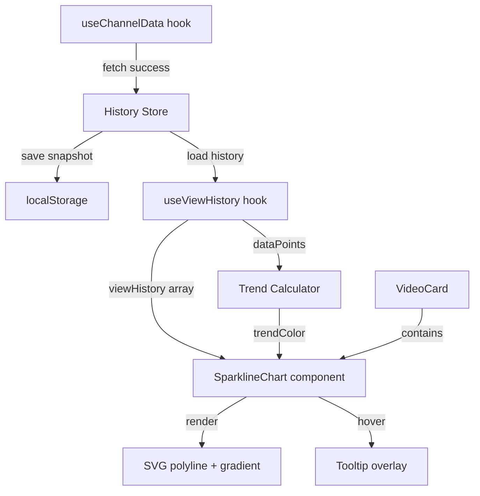

# Design Document: Sparkline View Trends

## Overview

Sparkline View Trends dodaje do VideoCard mini-wykresy liniowe (sparkline) wizualizujące historię wyświetleń filmów w czasie. System składa się z trzech warstw:

1. **History Store** — moduł persystencji zapisujący snapshoty viewCount w localStorage przy każdym odświeżeniu
2. **Sparkline Chart** — komponent SVG renderujący linię trendu z animacją i tooltipem
3. **Trend Calculator** — czysta funkcja obliczająca kierunek trendu (wzrost/spadek/stagnacja)

Podejście: **pure SVG bez zewnętrznej biblioteki chartingowej**. Uzasadnienie:
- Sparkline to prosta polilinia — nie potrzebujemy osi, legendy ani interakcji wykresowych
- Brak dodatkowej zależności = mniejszy bundle (0 KB vs ~30-50 KB dla recharts/chart.js)
- Pełna kontrola nad animacją stroke-dashoffset i integracją z CSS variables
- Projekt nie ma żadnej biblioteki chartingowej — dodawanie jednej dla 1 komponentu to overkill

## Architecture



### Przepływ danych

1. `useChannelData` pobiera dane → po sukcesie wywołuje `historyStore.saveSnapshot(videoId, viewCount)`
2. `useViewHistory(videoId)` hook ładuje historię z localStorage i zwraca `dataPoints[]`
3. `SparklineChart` otrzymuje `dataPoints`, oblicza trend, renderuje SVG
4. Hover na SVG → tooltip z formatowanymi danymi punktu

### Integracja z istniejącym kodem

- **VideoCard.jsx** — dodanie `<SparklineChart>` pod sekcją statystyk
- **useChannelData.js** — po `saveChannelData()` wywołanie `historyStore.saveSnapshots(videos)`
- **storage.js** — History Store jako osobny moduł (nie modyfikujemy istniejącego pliku)
- **formatters.js** — reużycie `formatViewCount()` w tooltipie

## Components and Interfaces

### 1. History Store (`src/utils/viewHistory.js`)

```javascript
// Klucz localStorage
const HISTORY_PREFIX = 'creator-dashboard-view-history-';
const MAX_POINTS = 50;
const DISPLAY_POINTS = 30;

/**
 * Zapisuje snapshot viewCount dla jednego filmu
 * @param {string} videoId - ID filmu (YouTube videoId lub TikTok id)
 * @param {number} viewCount - aktualna liczba wyświetleń
 * @returns {boolean} true jeśli zapis się powiódł
 */
export function saveSnapshot(videoId, viewCount) { ... }

/**
 * Zapisuje snapshoty dla tablicy filmów (batch)
 * @param {Array<{id: string, viewCount: number}>} videos
 */
export function saveSnapshots(videos) { ... }

/**
 * Ładuje historię wyświetleń dla filmu
 * @param {string} videoId
 * @returns {Array<{timestamp: number, viewCount: number}>} posortowane chronologicznie
 */
export function loadHistory(videoId) { ... }

/**
 * Usuwa historię dla listy filmów (przy usuwaniu kanału)
 * @param {string[]} videoIds
 */
export function removeHistories(videoIds) { ... }

/**
 * Obsługa QuotaExceededError — usuwa 25% najstarszych punktów ze wszystkich historii
 * @returns {boolean} true jeśli udało się zwolnić miejsce
 */
function pruneOldestEntries() { ... }
```

### 2. Trend Calculator (`src/utils/trendCalculator.js`)

```javascript
/**
 * Oblicza kierunek trendu na podstawie serii danych
 * @param {Array<{timestamp: number, viewCount: number}>} dataPoints
 * @returns {'up' | 'down' | 'neutral'} kierunek trendu
 */
export function calculateTrend(dataPoints) { ... }

/**
 * Oblicza procent zmiany między pierwszym a ostatnim punktem
 * @param {Array<{timestamp: number, viewCount: number}>} dataPoints
 * @returns {number} procent zmiany (np. 5.2 oznacza +5.2%)
 */
export function calculatePercentChange(dataPoints) { ... }
```

Logika trendu:
- `percentChange >= 1` → `'up'`
- `percentChange <= -1` → `'down'`
- `-1 < percentChange < 1` → `'neutral'`

### 3. useViewHistory Hook (`src/hooks/useViewHistory.js`)

```javascript
/**
 * Hook ładujący historię wyświetleń dla filmu
 * @param {string} videoId
 * @returns {{ dataPoints: DataPoint[], trend: 'up'|'down'|'neutral' }}
 */
export function useViewHistory(videoId) { ... }
```

### 4. SparklineChart Component (`src/components/SparklineChart.jsx`)

```jsx
/**
 * Props:
 * @param {Array<{timestamp: number, viewCount: number}>} dataPoints - max 30 punktów
 * @param {'up'|'down'|'neutral'} trend - kierunek trendu (determinuje kolor)
 */
export default function SparklineChart({ dataPoints, trend }) { ... }
```

Odpowiedzialności:
- Renderowanie SVG polyline z punktami przeskalowanymi do viewBox
- Gradient fill pod linią (opacity 0.1)
- Animacja stroke-dashoffset przy mount (300ms ease-out)
- Obsługa hover → tooltip + vertical indicator line
- Graceful degradation: 0 punktów = nic, 1 punkt = kropka + "Za mało danych"

### 5. Tooltip Component (wewnętrzny w SparklineChart)

Renderowany jako `<div>` pozycjonowany absolutnie nad SVG:
- Format: `"{formatViewCount(viewCount)} — {DD.MM.YYYY HH:mm}"`
- Snap do najbliższego punktu na osi X
- Flip na lewą stronę gdy nie mieści się po prawej

## Data Models

### DataPoint

```javascript
{
  timestamp: number,  // Unix ms (Date.now())
  viewCount: number   // liczba wyświetleń w momencie snapshotu
}
```

### View History (localStorage)

Klucz: `creator-dashboard-view-history-{videoId}`

Wartość (JSON):
```javascript
[
  { "timestamp": 1719849600000, "viewCount": 12450 },
  { "timestamp": 1719936000000, "viewCount": 13200 },
  // ... max 50 elementów, posortowane chronologicznie (najstarszy pierwszy)
]
```

### Trend Colors (CSS Variables)

Dodane do `index.css` w `@theme` i `html.dark`:

```css
/* Light mode (w @theme) */
--color-trend-up: #22C55E;
--color-trend-down: #EF4444;
--color-trend-neutral: #6B7280;

/* Dark mode (w html.dark) */
--color-trend-up: #4ADE80;
--color-trend-down: #F87171;
--color-trend-neutral: #9CA3AF;
```

### SVG Geometry

- ViewBox: `0 0 {width} 32` (width = container width via ResizeObserver lub 100%)
- Padding wewnętrzny: 4px (aby linia nie dotykała krawędzi)
- Skalowanie Y: `y = padding + (1 - (value - min) / (max - min)) * (height - 2*padding)`
- Gdy min === max: `y = height / 2` (linia pozioma na środku)
- Margines 10% na osi Y: `adjustedMin = min - range*0.1`, `adjustedMax = max + range*0.1`

## Correctness Properties

*A property is a characteristic or behavior that should hold true across all valid executions of a system — essentially, a formal statement about what the system should do. Properties serve as the bridge between human-readable specifications and machine-verifiable correctness guarantees.*

### Property 1: Save snapshot appends to history

*For any* video ID and valid viewCount (positive integer), calling `saveSnapshot(videoId, viewCount)` when the last recorded viewCount differs from the new value SHALL result in the video's history length increasing by exactly 1, and the last element SHALL contain the provided viewCount.

**Validates: Requirements 1.1**

### Property 2: Duplicate viewCount is not saved

*For any* video ID with existing history where the last Data_Point has viewCount V, calling `saveSnapshot(videoId, V)` SHALL leave the history unchanged (same length, same contents).

**Validates: Requirements 1.3**

### Property 3: History never exceeds 50 points

*For any* sequence of N saveSnapshot calls (N ≥ 1) for a single video ID with distinct viewCounts, the resulting history length SHALL be `min(N, 50)`, and when N > 50 the oldest entries SHALL have been removed.

**Validates: Requirements 1.4**

### Property 4: QuotaExceeded pruning frees space

*For any* set of videos with histories totaling T data points, when a QuotaExceededError occurs during save, the pruning operation SHALL remove at least 25% of the oldest points from each video's history (floor of count * 0.25), resulting in a total point count ≤ T * 0.75.

**Validates: Requirements 1.5**

### Property 5: Remove histories deletes all specified entries

*For any* list of video IDs with existing histories, calling `removeHistories(videoIds)` SHALL result in `loadHistory(id)` returning an empty array for every ID in the list.

**Validates: Requirements 1.6**

### Property 6: Display uses at most 30 most recent points

*For any* history with N data points (N ≥ 2), the SparklineChart SHALL receive exactly `min(N, 30)` points, and those points SHALL be the N most recent (highest timestamps) from the full history.

**Validates: Requirements 2.1**

### Property 7: Y-coordinate scaling correctness

*For any* array of data points with viewCounts, the computed Y coordinates SHALL satisfy:
- All Y values are within `[padding, height - padding]`
- When all viewCounts are identical, all Y values equal `height / 2`
- When viewCounts differ, the minimum viewCount maps to the bottom region and maximum to the top region (with 10% margin applied)

**Validates: Requirements 2.6, 2.7**

### Property 8: Trend classification matches percent change formula

*For any* data point series with at least 2 points where `first` is the oldest and `last` is the newest viewCount:
- `calculatePercentChange` SHALL return `((last - first) / first) * 100`
- When result ≥ 1 → `calculateTrend` returns `'up'`
- When result ≤ -1 → `calculateTrend` returns `'down'`
- When -1 < result < 1 → `calculateTrend` returns `'neutral'`

**Validates: Requirements 3.1, 3.2, 3.3, 3.6**

### Property 9: Snap to nearest point

*For any* set of data points rendered at known X positions and any cursor X coordinate within the chart bounds, `findNearestPoint(cursorX, points)` SHALL return the point whose rendered X position has the minimum absolute distance to cursorX.

**Validates: Requirements 6.1**

### Property 10: Tooltip positioning within bounds

*For any* cursor X position, container width, and tooltip width, the computed tooltip X position SHALL satisfy `0 ≤ tooltipX` and `tooltipX + tooltipWidth ≤ containerWidth`. When the tooltip would overflow the right edge, it SHALL be positioned to the left of the cursor.

**Validates: Requirements 6.6**

## Error Handling

### localStorage Errors

| Scenariusz | Zachowanie |
|---|---|
| `QuotaExceededError` przy zapisie | Prune 25% najstarszych punktów ze wszystkich historii, retry max 3× |
| `JSON.parse` error przy odczycie | Zwróć pustą tablicę, zaloguj warning |
| `localStorage` niedostępny (prywatny tryb Safari) | Graceful degradation — sparkline nie wyświetla się (brak danych) |
| Uszkodzone dane (nieprawidłowy format) | Odrzuć wpis, zwróć pustą tablicę |

### Rendering Edge Cases

| Scenariusz | Zachowanie |
|---|---|
| 0 data points | Nie renderuj SparklineChart |
| 1 data point | Kropka (circle 4px) + tekst "Za mało danych" |
| Wszystkie wartości identyczne | Pozioma linia na środku, kolor szary |
| viewCount = 0 (pierwszy punkt) | Unikaj dzielenia przez zero w formule trendu → zwróć 'neutral' |
| Bardzo duże wartości (>1B) | formatViewCount obsługuje (zwraca "X,YB") |

### Component Lifecycle

- `useViewHistory` ładuje dane synchronicznie z localStorage (brak async)
- Jeśli localStorage jest wolny, hook zwraca pustą tablicę → brak sparkline
- Przy unmount komponentu, tooltip jest czyszczony (brak memory leaks z event listeners)

## Testing Strategy

### Property-Based Tests (Vitest + fast-check)

Biblioteka: **fast-check** (najlepsza PBT library dla JS/TS, zero dependencies, doskonała integracja z Vitest)

Konfiguracja:
- Minimum 100 iteracji na property test
- Każdy test otagowany komentarzem: `// Feature: sparkline-view-trends, Property N: {title}`

Testowane moduły:
1. `viewHistory.js` — Properties 1-5 (save, duplicate skip, cap, prune, remove)
2. `trendCalculator.js` — Property 8 (trend classification + percent change)
3. Funkcja skalowania Y — Property 7 (coordinate correctness)
4. `findNearestPoint` — Property 9 (snap algorithm)
5. Tooltip positioning — Property 10 (bounds checking)
6. Display point slicing — Property 6 (max 30 recent)

### Unit Tests (Vitest)

Testowane scenariusze (example-based):
- Rendering: SVG dimensions (100% × 32px), stroke-width 1.5px, brak osi
- Edge cases: 0 points (no render), 1 point (circle + text), identical values (horizontal line)
- Tooltip format: `"{formatViewCount} — {DD.MM.YYYY HH:mm}"`
- CSS: border-radius, margin-top 8px, gradient fill opacity
- Animation: stroke-dashoffset presence, 300ms duration
- Platform agnostic: same output for YouTube and TikTok video IDs
- Dark mode: CSS variables used (no hardcoded colors)

### Integration Tests

- `useChannelData` → `saveSnapshots` flow: verify history is saved after successful fetch
- Channel deletion → `removeHistories` flow: verify cleanup
- Full render: VideoCard with history → SparklineChart visible with correct trend color

### Test Setup

```bash
npm install -D vitest fast-check @testing-library/react @testing-library/jest-dom jsdom
```

Vitest config (w `vite.config.js`):
```javascript
test: {
  environment: 'jsdom',
  globals: true,
  setupFiles: ['./src/test/setup.js']
}
```

